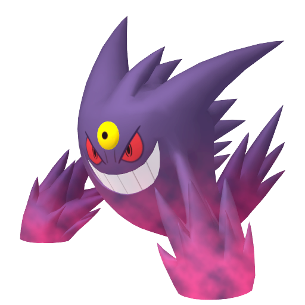

# 🐾 NyxFeline — Portfolio Website

> Personal portfolio website of **Đỗ Thiệu Vy** — Fullstack Developer based in Ho Chi Minh City.

---

## 🚀 Live Demo

👉 [https://your-site-url](https://your-site-url)

---

## 🧠 Overview

A minimalist, performance-focused portfolio built with pure HTML, CSS, and JavaScript. No frameworks, no bundlers — optimized for simplicity, fast load times, and full control over UI behavior.

---

## 🧰 Tech Stack

| Technology    | Details                       |
| ------------- | ----------------------------- |
| HTML5         | Semantic markup               |
| CSS3          | Custom properties, animations |
| JavaScript    | Vanilla, no bundlers          |
| No frameworks | Zero external dependencies    |

---

## ✨ Features

- 🖱️ Custom cursor interaction
- 📜 Scroll reveal animation
- 🌊 Parallax effects
- 📱 Responsive layout
- ⚡ Clean, lightweight structure

---

## 📁 Project Structure

```
vy-portfolio/
├── index.html       # Main page
├── style.css        # Styling & variables
├── script.js        # Interactions & effects
├── assets/          # Images (PNG)
└── README.md
```

---

## ⚙️ How To Run

Run locally with **Live Server** (Ritwick Dey):

1. Install the Live Server extension in VS Code
2. Right-click `index.html` in the file explorer
3. Select **Open with Live Server**

Or simply open `index.html` directly in your browser.

---

## 🎨 Customization

### Change Font

```html
<link
  href="https://fonts.googleapis.com/css2?family=Pacifico&display=swap"
  rel="stylesheet"
/>
```

```css
--font-display: "Pacifico", cursive;
--font-body: "Pacifico", cursive;
```

### Change Colors

```css
:root {
  --bg: #0a0010;
  --purple: #7b2fff;
  --lavender: #c084fc;
  --text: #e8dff5;
  --muted: #7c6d8a;
}
```

### Replace Images

```html

```

### Add Project Card

Duplicate the `.project-card` block in `index.html`.

---

## 📌 Design Philosophy

- **Minimal dependencies** — easier long-term maintenance
- **Visual identity** driven by a dark + neon palette
- **Interaction-first UI** — cursor behavior, motion, and depth

---

## 👤 Author

**Đỗ Thiệu Vy** — Fullstack Developer · Ho Chi Minh City

- 📧 Email: [dothieuvy@gmail.com](mailto:dothieuvy@gmail.com)
- 🐙 GitHub: [github.com/NyxFeline](https://github.com/NyxFeline)
- 📞 Phone: 0981 324 463
